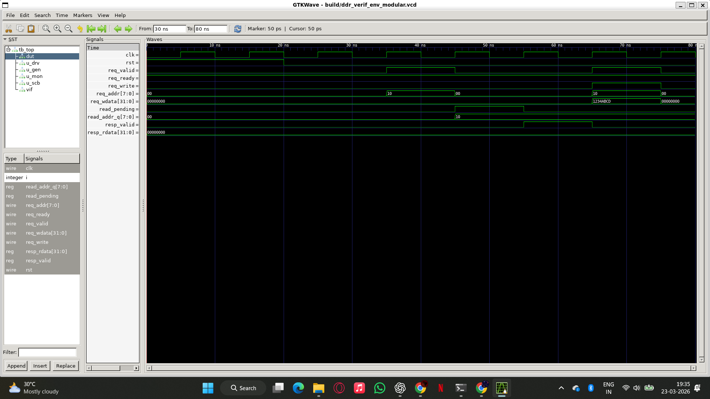
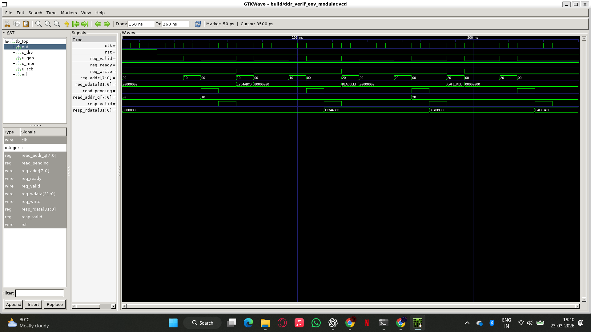

# DDR Controller Verification Environment (SystemVerilog)

## Overview
This project implements a self-checking SystemVerilog verification environment for a simplified DDR-style memory controller.

The environment verifies read/write behavior, read response latency, overwrite handling, boundary-style address activity, request/response protocol behavior, and data correctness using a modular testbench architecture.

---

## Verification Architecture

```text
Generator -> Driver -> DUT -> Monitor -> Scoreboard
                  |          |
                  |          +-> SVA Protocol Checks
                  +------------> Functional Coverage Tracker
```

### Components
- **Generator:** Produces directed and constrained randomized read/write transactions
- **Driver:** Drives transaction-level stimulus into the DUT request interface
- **Monitor:** Observes request/response behavior and converts it into actual transactions
- **Scoreboard:** Compares expected vs. observed memory behavior
- **SVA Checker:** Verifies request-response timing, spurious response behavior, and valid address acceptance
- **Coverage Tracker:** Tracks read/write bins, address-range bins, response bins, and operation x address cross bins
- **DUT:** Simplified DDR-style memory controller with fixed 1-cycle read latency

---

## DUT Interface Signals

| Signal | Width | Description |
|---|---:|---|
| `req_valid` | 1 | Request valid |
| `req_ready` | 1 | DUT ready |
| `req_write` | 1 | 1 = write, 0 = read |
| `req_addr` | 8 | Memory address |
| `req_wdata` | 32 | Write data |
| `resp_valid` | 1 | Read response valid |
| `resp_rdata` | 32 | Read response data |

---

## Verification Scenarios

- Read from empty memory -> returns `0x00000000`
- Write/readback at address `0x10`
- Write/readback at address `0x20`
- Overwrite address `0x20` and verify latest data wins
- Constrained randomized write/read pairs across low, mid, and high address ranges
- Request-response timing protocol checks using SVA
- Scoreboard-based expected vs. observed comparison

---

## Assertion Checks

Implemented in `tb/ddr_assertions.sv`:

- `p_read_response_within_4_cycles`: accepted reads must return `resp_valid` within 1-4 cycles
- `p_no_spurious_response`: response must not occur without a pending read request
- `p_known_addr_on_accept`: accepted request address must not be X/Z

---

## Functional Coverage Tracking

Implemented in `tb/coverage_tracker.sv`:

- Operation bins: writes, reads
- Address range bins: low, mid, high
- Response bin: observed read responses
- Cross bins: write/read x address range

---

## How to Run

### Recommended regression command

```bash
python3 scripts/run_regression.py
```

The script compiles, runs, checks the scoreboard/assertion status, and saves the log to:

```text
proof/ddr_regression.log
```

### Manual command

```bash
mkdir -p build proof
iverilog -g2012 -gsupported-assertions -Wall -o build/ddr_verif_env_modular.out \
rtl/ddr_controller.sv \
tb/ddr_if.sv \
tb/generator.sv \
tb/driver.sv \
tb/monitor.sv \
tb/scoreboard.sv \
tb/ddr_assertions.sv \
tb/coverage_tracker.sv \
tb/tb_top.sv

vvp build/ddr_verif_env_modular.out | tee proof/ddr_regression.log

gtkwave build/ddr_verif_env_modular.vcd
```

---

## Expected Result

A passing run should include:

```text
SCOREBOARD SUMMARY: PASS=<non-zero> FAIL=0
FUNCTIONAL COVERAGE SUMMARY
REGRESSION PASSED
```

---

## Waveform Proof

### Read from Empty Memory


### Write Transaction


### Readback Verification


### Overwrite and Final Readback


---

## Key Concepts Demonstrated

- SystemVerilog testbench development
- Generator / Driver / Monitor / Scoreboard architecture
- UVM-inspired modular verification structure
- SVA-based protocol checking
- Constrained randomized transaction generation
- Functional coverage tracking with operation/address/cross bins
- Scoreboard-based self-checking validation
- Waveform and log-based debug
- Regression scripting with Python
